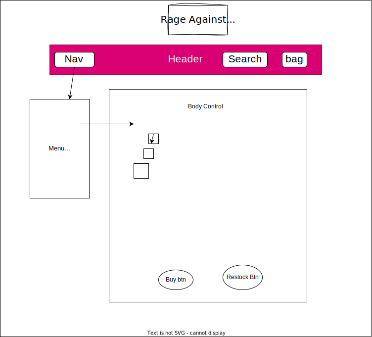

# Merch Site

## By Ravin Fisher, Gabriel Tucker and Kim Robinson

## Bugs
* Click on nav button, want display inventory filtered (5 options)
*Search function non funcitonal
*Cart non functional
*Buy button non funcitonal to update qty
*Restock button non functinoal to update qty
*Need to add a create and add and delete item.

This template provides a minimal setup to get React working in Vite with HMR and some ESLint rules.

Currently, two official plugins are available:

- [@vitejs/plugin-react](https://github.com/vitejs/vite-plugin-react/blob/main/packages/plugin-react/README.md) uses [Babel](https://babeljs.io/) for Fast Refresh
- [@vitejs/plugin-react-swc](https://github.com/vitejs/vite-plugin-react-swc) uses [SWC](https://swc.rs/) for Fast Refresh
